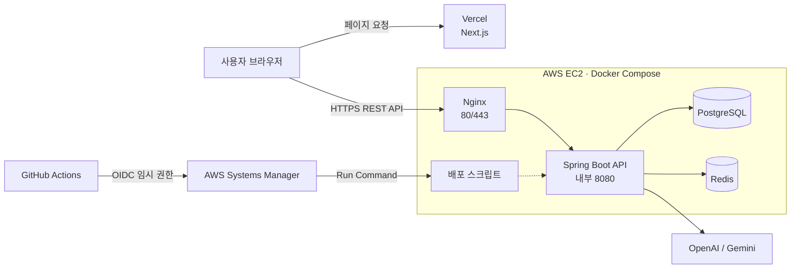

  

<h1 align="center">My English Vocab</h1>

  내가 모르는 영어 단어만 모아 AI 예문과 함께 학습하는 개인 맞춤형 영어 단어장

  <a href="https://app.myenglishvocab.com"><strong>서비스 사용해 보기</strong></a>
  ·
  <a href="https://github.com/my-english-vocab/web">Web</a>
  ·
  <a href="https://github.com/my-english-vocab/api">API</a>

---

## 프로젝트 소개

**My English Vocab**은 사용자가 직접 영어 단어를 저장하고, AI가 생성한 뜻·예문·해석과 퀴즈를 이용해 반복 학습하는 웹 애플리케이션입니다.

단어 CRUD에 그치지 않고 인증과 사용자별 데이터 격리, AI API 연동과 사용량 제한, 퀴즈 학습 기록, 관리자 통계, 데이터베이스 마이그레이션, 테스트, CI/CD와 운영 환경까지 하나의 서비스 흐름으로 구현했습니다.

## 주요 기능

| 영역 | 기능 |
| --- | --- |
| **회원 인증** | 회원가입·로그인·로그아웃, Access Token 자동 재발급, 비밀번호 재확인 기반 회원 탈퇴 |
| **나의 단어장** | 사용자별 단어 CRUD, 정렬, 학습 레벨, 즐겨찾기 설정과 필터 |
| **AI 학습 콘텐츠** | OpenAI 또는 Gemini를 이용한 뜻·예문·해석 생성, 결과 수정 후 저장, 계정별 일일 사용량 제한 |
| **단어 퀴즈** | 전체 랜덤 또는 등록 순서 기준 20개 단위 세트, 문제 순서 무작위 구성, 학습 레벨 반영, 세트별 완료 기록 |
| **운영 통계** | 관리자 권한 분리, DAU·MAU, 가입·탈퇴, 페이지 방문, AI·단어·퀴즈 사용 현황과 인기 항목 조회 |

## 저장소

| Repository | 역할 | 주요 기술 |
| --- | --- | --- |
| [`web`](https://github.com/my-english-vocab/web) | 사용자 화면, 인증 상태 관리, 단어장·퀴즈·관리자 대시보드 | Next.js, React, TypeScript, Vitest |
| [`api`](https://github.com/my-english-vocab/api) | 인증·권한, 단어·퀴즈·통계 API, AI 연동, 데이터와 운영 환경 | Java, Spring Boot, PostgreSQL, Redis |

각 저장소의 실행 방법, 환경 변수, 테스트 명령과 세부 설계는 해당 README에서 확인할 수 있습니다.

## 운영 아키텍처

- 프론트엔드는 Vercel, 백엔드는 AWS EC2에서 운영합니다.
- EC2에서는 Nginx만 `80`·`443` 포트를 공개하고 애플리케이션·PostgreSQL·Redis는 Docker 내부 네트워크에 둡니다.
- HTTPS는 Let's Encrypt 인증서와 Certbot 자동 갱신으로 관리합니다.

## 기술 스택

| 구분 | 기술 |
| --- | --- |
| **Frontend** | Next.js 16.3, React 19.2, TypeScript 5, CSS Modules, Design Tokens |
| **Backend** | Java 21, Spring Boot 4.0, Spring Security, Spring Data JPA·Redis, Spring Boot Actuator |
| **Data** | PostgreSQL 17, Redis 7, Flyway, H2 |
| **AI** | OpenAI API, Gemini API |
| **Test** | JUnit, Spring Security Test, Vitest, React Testing Library |
| **Infrastructure** | Docker Compose, Nginx, Certbot, Vercel, AWS EC2·Systems Manager |
| **CI/CD** | GitHub Actions, GitHub OIDC, AWS SSM Run Command |

## 설계와 운영에서 중요하게 다룬 부분

### 인증과 권한

- Access Token은 브라우저 메모리에만 보관합니다.
- Refresh Token은 JavaScript에서 읽을 수 없는 `HttpOnly` 쿠키와 Redis에 저장하고, 재발급할 때마다 교체합니다.
- 사용자별 리소스 소유권과 `USER`·`ADMIN` 권한은 프론트 화면이 아닌 백엔드에서 검증합니다.
- 운영 환경은 HTTPS, 명시적인 CORS 허용 목록과 `Secure` 쿠키를 사용합니다.

### 테스트와 지속적 통합

- Web CI는 Pull Request와 `main` 변경에서 lint, Vitest, Next.js production build를 실행합니다.
- API CI는 Pull Request와 `main` 변경에서 JDK 21 기반 테스트를 실행합니다.
- 인증·권한, 사용자별 데이터 격리, 토큰 재발급, 퀴즈 완료 기록, 관리자 통계와 운영 설정을 자동 테스트합니다.

### 배포와 운영

- 백엔드는 장기 AWS Access Key 대신 GitHub OIDC 임시 권한을 사용합니다.
- AWS Systems Manager Run Command로 EC2의 코드를 갱신하고 Docker Compose 서비스를 재빌드합니다.
- 배포 후 내부·외부 Health Check를 수행하고, 실패하면 컨테이너 상태와 제한된 Docker 로그를 수집합니다.
- Docker 로그 순환, Flyway 마이그레이션과 PostgreSQL 정기 백업을 적용했습니다.

## 운영 서비스

- Web: [https://app.myenglishvocab.com](https://app.myenglishvocab.com)
- API Health: [https://api.myenglishvocab.com/actuator/health](https://api.myenglishvocab.com/actuator/health)

운영 API에서는 내부 설정 보호를 위해 Swagger와 상세 Actuator 정보를 공개하지 않습니다.
